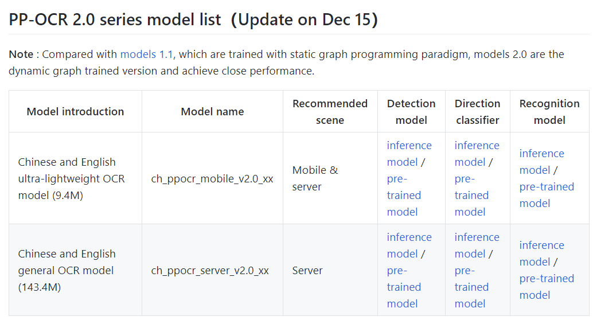
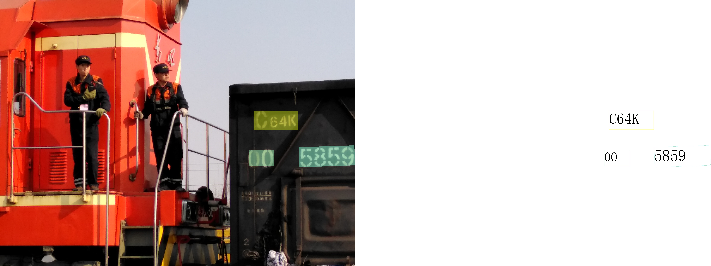

# Railway_OCR
Railway info detection based on paddleOCR

## Clone this repository
```
git clone https://github.com/TommyGong08/Railway_OCR.git
```

## Env Config
```
pip install -r requirements.txt -i https://mirror.baidu.com/pypi/simple 
```

## Setup the Model
Place both OCR detection model & recognition model in the "model" file 
you can also download the model from https://github.com/PaddlePaddle/PaddleOCR  




## Run 
### single picture
```
python interface.py --image_dir="./train_OCR_img_test/IMG_20190402_142206.jpg" --det_model_dir="./model/ch_ppocr_mobile_v2.0_det_infer" --rec_model_dir="./model/ch_ppocr_mobile_v2.0_rec_infer"
```
### Multi picture
```
python interface.py --image_dir="./train_OCR_img_test" --det_model_dir="./model/ch_ppocr_mobile_v2.0_det_infer" --rec_model_dir="./model/ch_ppocr_mobile_v2.0_rec_infer"
```

## Result


